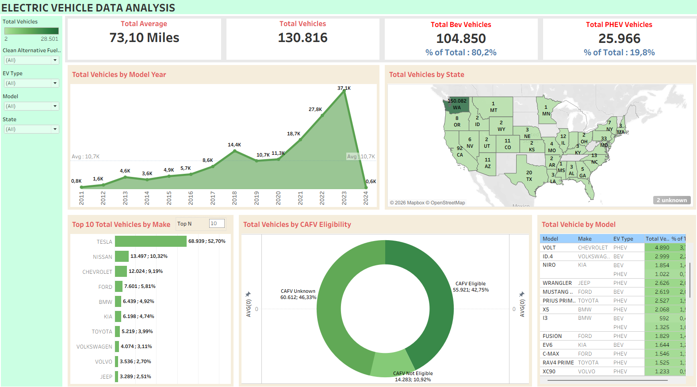

# 📊 Tableau Portfolio — EV Population Analysis

Analisis distribusi dan tren adopsi kendaraan listrik (Electric Vehicle) di United States berbasis data populasi EV.

---

## 📌 Tentang Proyek

Proyek ini menganalisis data populasi kendaraan listrik di AS untuk memahami tren adopsi, dominasi merek, distribusi geografis, dan dampak kebijakan insentif CAFV.

**Dataset:** Electric Vehicle Population Data — mencakup informasi VIN, lokasi (county, city, state), model year, merek, model, tipe EV (BEV/PHEV), eligibilitas CAFV, dan electric range.

---

## 📋 Kolom Dataset

| Kolom | Tipe | Deskripsi |
|---|---|---|
| `VIN (1-10)` | String | Identifikasi kendaraan (10 karakter pertama) |
| `County` | String | Nama county tempat kendaraan terdaftar |
| `City` | String | Nama kota |
| `State` | String | Singkatan negara bagian |
| `Postal Code` | Integer | Kode pos |
| `Model Year` | Integer | Tahun model kendaraan |
| `Make` | String | Produsen / merek kendaraan |
| `Model` | String | Nama model kendaraan |
| `Electric Vehicle Type` | String | Tipe: BEV (Battery EV) atau PHEV (Plug-in Hybrid EV) |
| `CAFV Eligibility` | String | Status kelayakan insentif Clean Alternative Fuel Vehicle |
| `Electric Range` | Integer | Jangkauan listrik dalam mil |
| `Base MSRP` | Integer | Harga dasar resmi |
| `Legislative District` | Integer | Distrik legislatif |
| `DOL Vehicle ID` | Integer | ID kendaraan dari Department of Licenses |
| `Vehicle Location` | String | Koordinat lokasi kendaraan |
| `Electric Utility` | String | Perusahaan listrik lokal |
| `2020 Census Tract` | Integer | Tract sensus 2020 |

---

## 📊 Visualisasi di Tableau Workbook

Workbook ini berisi **9 worksheet** dan **1 dashboard** interaktif:

### Worksheets

| # | Nama Sheet | Deskripsi |
|---|---|---|
| 1 | **Total Vehicles** | Tampilan total jumlah kendaraan listrik keseluruhan |
| 2 | **Avg Electric Range** | Rata-rata jangkauan listrik kendaraan |
| 3 | **Total BEV Vehicles** | Jumlah kendaraan tipe Battery EV |
| 4 | **Total PHEV Vehicles** | Jumlah kendaraan tipe Plug-in Hybrid EV |
| 5 | **Total Vehicles by Model Year** | Distribusi kendaraan per tahun model (mulai 2010) — menunjukkan tren pertumbuhan adopsi |
| 6 | **Total Vehicles by State** | Distribusi geografis per negara bagian — mengidentifikasi wilayah dengan adopsi tertinggi |
| 7 | **Top 10 Total Vehicles by Make** | 10 merek teratas berdasarkan jumlah unit — menggunakan parameter Top N yang dinamis |
| 8 | **Total Vehicles by CAFV Eligibility** | Proporsi kendaraan yang memenuhi syarat insentif CAFV |
| 9 | **Total Vehicle by Model** | Tabel lengkap per model, Tesla Model Y memimpin dengan 28.501 unit (21,79%) |

### Dashboard

| Nama | Konten |
|---|---|
| **Dashboard 1** | Gabungan visualisasi utama — overview komprehensif adopsi EV di AS |

---

## 🔍 Key Findings

- **Tesla mendominasi pasar**, mengisi tiga posisi teratas dan dipimpin oleh Model Y.
- **BEV lebih populer dari PHEV** di seluruh dataset.
- **Tren adopsi meningkat signifikan** sejak 2010, dengan lonjakan besar di tahun-tahun terbaru.
- **Distribusi geografis tidak merata** — beberapa negara bagian menunjukkan tingkat adopsi jauh lebih tinggi.
- **Insentif CAFV berpengaruh** terhadap komposisi kendaraan yang terdaftar.

---

## 🛠️ Tools

- **Tableau Desktop 2023.1**
- **Dataset sumber:** Electric_Vehicle_Population_Data.csv

---

## 👤 Author

- Raditya Ghifari A.
- Aprilla Suryamanda
- Maulana Ravi
